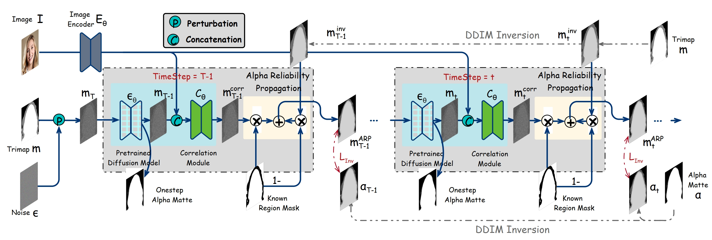

# **DiffusionMat: Alpha Matting as Sequential Refinement Learning**

[paper](https://arxiv.org/pdf/2311.13535.pdf) |  [project website](https://cnnlstm.github.io/DiffusionMat/)

## Abstract

In this paper, we introduce DiffusionMat, a novel image matting framework that employs a diffusion model for the transition from coarse to refined alpha mattes. Diverging from conventional methods that utilize trimaps merely as loose guidance for alpha matte prediction, our approach treats image matting as a sequential refinement learning process. This process begins with the addition of noise to trimaps and iteratively denoises them using a pre-trained diffusion model, which incrementally guides the prediction towards a clean alpha matte. The key innovation of our framework is a correction module that adjusts the output at each denoising step, ensuring that the final result is consistent with the input image's structures. We also introduce the Alpha Reliability Propagation, a novel technique designed to maximize the utility of available guidance by selectively enhancing the trimap regions with confident alpha information, thus simplifying the correction task. To train the correction module, we devise specialized loss functions that target the accuracy of the alpha matte's edges and the consistency of its opaque and transparent regions. We evaluate our model across several image matting benchmarks, and the results indicate that DiffusionMat consistently outperforms existing methods.




## Set up

### Installation

```
git clone https://github.com/cnnlstm/DiffusionMat.git
cd DiffusionMat
```

### Environment

The environment can be set up  from the provided `diffusionmat.yaml`:

```
conda env create -f diffusionmat.yaml
```

## Quick Start

### Pretrained Models

Please download our pre-trained model, unzip it and put in  `./pretrained_models`.

| Model | Description
| :--- | :----------
|[Composition-1k](https://drive.google.com/file/d/1Nl6lu0YJru3gI-KVSihQ78IzWj9adL_g/view?usp=drive_link)  | Trained on Composition-1k.

### Inference

The testset of Composition-1k dataset can be downloaded at: [Composition-1k-Testset](https://drive.google.com/file/d/1fS-uh2Fi0APygd0NPjqfT7jCwUu_a_Xu/view?usp=sharing)

```
python inference.py --exp inference_dir  --config matte.yml --delta_config deltablock.yml --sample -i images --t 250 --sample_step 5 --ni
```

### Evaluation

Evaluate the results by the official evaluation MATLAB code **./DIM_evaluation_code/evaluate.m** (provided by [Deep Image Matting](https://sites.google.com/view/deepimagematting))


## Training

### Preparation

For obtain the trainset of Composition-1k dataset, please refer to: [Matteformer](https://github.com/webtoon/matteformer)

Please modify the trainingset path at https://github.com/cnnlstm/diffusionmat/blob/df4974ba66b3f2f9c9788ce38bb87e6b2b583d33/runners/diffusionmat.py#L168


### Start Training

```
python train.py --exp training_dir --config matte.yml --delta_config deltablock.yml --sample -i images --t 250 --sample_step 5 --ni
```


## Citation

If you find this work useful for your research, please cite:

```
@article{xu2023diffusionmat,
title={DiffusionMat: Alpha Matting as Sequential Refinement Learning},
author={Xu, Yangyang and He, Shengfeng and Shao, Wenqi and Wong, Kwan-Yee K and Qiao, Yu and Luo, Ping},
journal={arXiv preprint arXiv:2311.13535},
year={2023}
}
```


## Acknowledgement

Our Codes are mainly originated from  [SDEdit](https://github.com/ermongroup/SDEdit).
